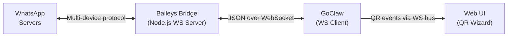

# WhatsApp Channel

WhatsApp integration via an external Baileys-based WebSocket bridge. GoClaw connects as a WS client to the bridge, which handles the WhatsApp multi-device protocol (no Chrome required).

## Setup

### Quick Start (Docker Compose)

The fastest way to run WhatsApp is with the included Docker Compose overlay:

```bash
docker compose -f docker-compose.yml -f docker-compose.postgres.yml -f docker-compose.whatsapp.yml up -d
```

Then in the GoClaw UI:
1. **Channels > Add Channel > WhatsApp**
2. Set **Bridge URL** to `ws://whatsapp-bridge:3001`
3. Choose an agent, click **Create & Scan QR**
4. Scan the QR code with WhatsApp (You > Linked Devices > Link a Device)

### Manual Bridge Setup

If you prefer running the bridge outside Docker:

```bash
cd bridge/whatsapp
npm install
node server.js
```

Environment variables:

| Variable | Default | Description |
|----------|---------|-------------|
| `BRIDGE_PORT` | `3001` | WebSocket server port |
| `AUTH_DIR` | `./auth_info` | Directory for WhatsApp auth state |
| `MEDIA_DIR` | OS temp dir | Directory for downloaded media files |
| `MEDIA_MAX_BYTES` | `20971520` (20 MB) | Max media download size |
| `LOG_LEVEL` | `silent` | Bridge log level (`silent`, `warn`) |
| `PRINT_QR` | `false` | Print QR code to terminal (useful without UI) |

### Config File Setup

For config-file-based channels (instead of DB instances):

```json
{
  "channels": {
    "whatsapp": {
      "enabled": true,
      "bridge_url": "ws://localhost:3001",
      "dm_policy": "pairing",
      "group_policy": "pairing"
    }
  }
}
```

## Configuration

All config keys are in `channels.whatsapp` (config file) or the instance config JSON (DB):

| Key | Type | Default | Description |
|-----|------|---------|-------------|
| `enabled` | bool | `false` | Enable/disable channel |
| `bridge_url` | string | required | WebSocket URL to bridge (e.g., `ws://bridge:3001`) |
| `allow_from` | list | -- | User/group ID allowlist |
| `dm_policy` | string | `"pairing"` | `pairing`, `open`, `allowlist`, `disabled` |
| `group_policy` | string | `"pairing"` (DB) / `"open"` (config) | `pairing`, `open`, `allowlist`, `disabled` |
| `require_mention` | bool | `false` | Only respond in groups when bot is @mentioned |
| `block_reply` | bool | -- | Override gateway block_reply (nil=inherit) |

## Architecture



- **Bridge** is the WebSocket **server** (default port 3001)
- **GoClaw** connects as a **client** and handles routing, AI, pairing
- One bridge instance = one WhatsApp phone number
- Media files are exchanged via a shared volume (`/tmp/goclaw_wa_media`)

## Features

### QR Code Authentication

WhatsApp requires QR code scanning to link a device. The flow:

1. Bridge generates QR via Baileys connection
2. Bridge sends `{type: "qr", data: "<qr-string>"}` to GoClaw
3. GoClaw encodes as PNG and broadcasts via bus event
4. Web UI wizard displays the QR image
5. User scans with WhatsApp (You > Linked Devices > Link a Device)
6. Bridge confirms auth: `{type: "status", connected: true}`

**Re-authentication**: Use the "Re-authenticate" button in the channels table to force a new QR scan (logs out the current WhatsApp session).

### DM and Group Policies

WhatsApp groups have chat IDs ending in `@g.us`:

- **DM**: `"1234567890@s.whatsapp.net"`
- **Group**: `"120363012345@g.us"`

Available policies:

| Policy | Behavior |
|--------|----------|
| `open` | Accept all messages |
| `pairing` | Require pairing code approval (default for DB instances) |
| `allowlist` | Only users in `allow_from` |
| `disabled` | Reject all messages |

Group `pairing` policy: unpaired groups receive a pairing code reply. Approve via `goclaw pairing approve <CODE>`.

### @Mention Gating

When `require_mention` is `true`, the bot only responds in group chats when explicitly @mentioned. Fails closed — if the bot's JID is unknown, messages are ignored.

### Media Support

The bridge downloads incoming media (images, video, audio, documents, stickers) to a shared volume. GoClaw reads these files and passes them to the agent pipeline.

Supported inbound media types: image, video, audio, document, sticker.

Outbound media: GoClaw writes files to the shared volume and sends the path to the bridge for delivery.

**Shared volume** (Docker): Both `goclaw` and `whatsapp-bridge` containers mount the same volume at `/tmp/goclaw_wa_media`.

### Message Formatting

LLM output is converted from Markdown to WhatsApp's native formatting:

| Markdown | WhatsApp | Rendered |
|----------|----------|----------|
| `**bold**` | `*bold*` | **bold** |
| `_italic_` | `_italic_` | _italic_ |
| `~~strikethrough~~` | `~strikethrough~` | ~~strikethrough~~ |
| `` `inline code` `` | ` ```code``` ` | `code` |
| `# Header` | `*Header*` | **Header** |
| `[text](url)` | `text url` | text url |
| `- list item` | `* list item` | * list item |

Fenced code blocks are preserved as ` ``` `. HTML tags from LLM output are pre-processed to Markdown equivalents before conversion.

### Typing Indicators

GoClaw shows "typing..." in WhatsApp while the agent processes a message. WhatsApp clears the indicator after ~10 seconds, so GoClaw refreshes every 8 seconds until the reply is sent.

### Auto-Reconnect

If the bridge connection drops:
- Exponential backoff: 1s > 2s > 4s > ... > 30s max
- Continuous retry until bridge is available
- Channel health status updated (degraded/healthy)

## Bridge Protocol

### Bridge > GoClaw

| Type | Payload | Description |
|------|---------|-------------|
| `status` | `{connected: bool, me: "jid"}` | Auth state (sent on connect + change) |
| `qr` | `{data: "qr-string"}` | QR code for scanning |
| `message` | `{id, from, chat, content, from_name, is_group, mentioned_jids, media}` | Incoming message |
| `pong` | `{}` | Response to ping |

### GoClaw > Bridge

| Type | Payload | Description |
|------|---------|-------------|
| `message` | `{to: "jid", content: "text"}` | Send outbound text |
| `command` | `{action: "reauth"}` | Logout + restart QR flow |
| `command` | `{action: "ping"}` | Health check |
| `command` | `{action: "presence", to, state}` | Presence (composing/paused) |

## Docker Compose

The `docker-compose.whatsapp.yml` overlay adds the bridge service:

```yaml
services:
  whatsapp-bridge:
    build: ./bridge/whatsapp
    ports:
      - "3001:3001"
    volumes:
      - wa_auth:/app/auth_info        # Persistent auth state
      - wa_media:/tmp/goclaw_wa_media  # Shared media volume
    environment:
      - BRIDGE_PORT=3001
      - PRINT_QR=false

  goclaw:
    volumes:
      - wa_media:/tmp/goclaw_wa_media  # Same media volume

volumes:
  wa_auth:
  wa_media:
```

## Troubleshooting

| Issue | Solution |
|-------|----------|
| "Connection refused" | Verify bridge is running and `bridge_url` is correct. For Docker, use `ws://whatsapp-bridge:3001`. |
| No QR code appears | Check bridge logs. Ensure the bridge can reach WhatsApp servers. Try `PRINT_QR=true` for terminal QR. |
| QR scanned but no auth | Auth state may be corrupted. Delete `auth_info/` directory and restart bridge. |
| Messages not received | Check bridge protocol: must send `type:"message"` with `from`/`content` fields (not `sender`/`body`). |
| Media not received | Ensure shared volume is mounted in both containers. Check `MEDIA_MAX_BYTES` limit. |
| "Bridge format mismatch" warning | Your bridge sends messages without a `type` field. Add `type:"message"` and use `from`/`content` field names. |
| Typing indicator stuck | GoClaw auto-cancels typing when reply is sent. If stuck, the bridge connection may have dropped. |
| Group messages ignored | Check `group_policy`. If `pairing`, the group needs approval. If `require_mention` is true, @mention the bot. |

## What's Next

- [Overview](/channels-overview) — Channel concepts and policies
- [Telegram](/channel-telegram) — Telegram bot setup
- [Larksuite](/channel-feishu) — Larksuite integration
- [Browser Pairing](/channel-browser-pairing) — Pairing flow

<!-- goclaw-source: e7626ed5 | updated: 2026-04-06 -->
