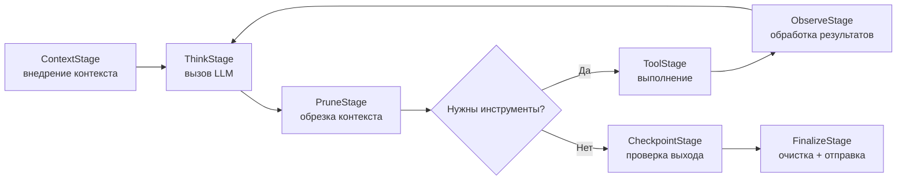
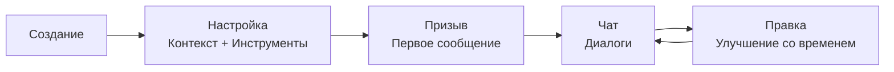

# Объяснение работы агентов

> Что такое агенты, как они работают и в чем разница между открытыми и предопределенными.

## Обзор

Агент в GoClaw — это LLM с личностью, инструментами и памятью. Вы настраиваете то, что он знает (файлы контекста), что он может делать (инструменты) и какая LLM им управляет (провайдер + модель). Каждый агент работает в своем конвейере, независимо обрабатывая диалоги.

## Из чего состоит агент

Агент объединяет четыре составляющие:

1. **LLM** — языковая модель, которая генерирует ответы (провайдер + модель).
2. **Файлы контекста** — Markdown-файлы, определяющие личность, знания и правила.
3. **Инструменты** — то, что агент может делать (поиск, код, браузер и т. д.).
4. **Память** — долгосрочные факты, сохраняющиеся между диалогами.

## Как работает конвейер агента

Каждый ход проходит через **8-этапный конвейер** (контекст → размышление → очистка → действие → наблюдение → контрольная точка → память → завершение). Все агенты всегда используют полный конвейер.

Цикл повторяется до 20 итераций за ход. GoClaw отслеживает зацикливание инструментов: выдается **предупреждение** после 3 идентичных вызовов подряд, и цикл **принудительно останавливается** после 5 идентичных вызовов без прогресса. Инструменты `exec`/`bash` и инструменты MCP (префикс `mcp_`) считаются **нейтральными** и не влияют на счетчик зацикливания.

## Типы агентов

В GoClaw есть два типа агентов с разными моделями совместного использования:

### Открытые агенты (Open Agents)

Каждый пользователь получает свою полную копию всех файлов контекста. Каждый пользователь может полностью настроить личность, инструкции и поведение агента — агент адаптируется независимо для каждого пользователя. Файлы сохраняются между сессиями.

- Все 7 файлов контекста уникальны для каждого пользователя (включая MEMORY.md).
- Пользователи могут читать и редактировать любые файлы (SOUL.md, IDENTITY.md и др.).
- Новые пользователи начинают с шаблонов уровня агента, а затем настраивают их под себя.
- Подходит для: личных ассистентов, индивидуальных рабочих процессов, прототипирования.

### Предопределенные агенты (Predefined Agents)

Агент имеет фиксированную, общую личность, которую пользователь не может изменить через чат. У каждого пользователя есть только личные файлы профиля. Это похоже на корпоративного чат-бота — один и тот же голос бренда для всех, но он знает, кто вы такой.

- 4 файла контекста общие для всех пользователей (SOUL, IDENTITY, AGENTS, TOOLS) — доступны только для чтения через чат.
- 3 файла уникальны для каждого пользователя (USER.md, USER_PREDEFINED.md, BOOTSTRAP.md).
- Общие файлы можно редактировать только через панель управления (не через чат).
- Подходит для: командных ботов, брендированных ассистентов, службы поддержки.

| Аспект | Открытый | Предопределенный |
|--------|------|-----------|
| Файлы уровня агента | Шаблоны (копируются пользователю) | 4 общих (SOUL, IDENTITY, AGENTS, TOOLS) |
| Файлы пользователя | Все 7 | 3 (USER.md, USER_PREDEFINED.md, BOOTSTRAP.md) |
| Редактирование в чате | Все файлы | Только USER.md |
| Личность | Своя для каждого пользователя | Фиксированная, общая для всех |
| Кейс | Личный ассистент | Бот команды/компании |

## Файлы контекста

Поведение агента определяют до 7 файлов контекста:

| Файл | Назначение | Пример контента |
|------|---------|----------------|
| `AGENTS.md` | Операционные инструкции, правила памяти и безопасности | "Всегда сохраняй важные факты в память..." |
| `SOUL.md` | Личность и тон общения | "Ты — дружелюбный наставник по коду..." |
| `IDENTITY.md` | Имя, аватар, приветствие | "Имя: CodeBot, Эмодзи: 🤖" |
| `TOOLS.md` | Руководство по инструментам | "Используй web_search для поиска новостей..." |
| `USER.md` | Профиль пользователя, часовой пояс, предпочтения | "Часовой пояс: Europe/Moscow, Язык: Русский" |
| `USER_PREDEFINED.md` | Профиль пользователя для предопределенного агента | "Информация о члене команды, общие настройки..." |
| `BOOTSTRAP.md` | Ритуал первого запуска (удаляется после завершения) | "Представься и узнай больше о пользователе..." |

Также есть `MEMORY.md` — постоянные заметки, обновляемые агентом (направляются в систему памяти).

Файлы контекста пишутся в формате Markdown. Их можно редактировать через панель управления, API или позволить агенту изменять их в процессе диалога.

### Ограничение длины (Truncation)

Большие файлы контекста автоматически обрезаются:
- Лимит на файл: 20 000 символов.
- Общий бюджет: 24 000 символов.
- При обрезке сохраняется 70% начала и 20% конца файла.

## Жизненный цикл агента

1. **Создание** — Определение имени, провайдера, модели.
2. **Настройка** — Написание файлов контекста, настройка прав инструментов.
3. **Призыв (Summon)** — Отправка первого сообщения; файлы начальной загрузки создаются автоматически.
4. **Чат** — Постоянное общение с использованием памяти и инструментов.
5. **Правка** — Уточнение файлов контекста, корректировка настроек.

## Контроль доступа

При доступе пользователя к агенту GoClaw проверяет:

1. Существует ли агент?
2. Является ли он агентом по умолчанию? → Разрешить (доступен всем).
3. Является ли пользователь владельцем (owner)? → Разрешить с ролью владельца.
4. Есть ли запись о совместном доступе (share)? → Разрешить с соответствующей ролью.

Роли: `admin` (полный контроль), `operator` (использование + правка), `viewer` (только чтение).

## Режимы системного промпта

GoClaw строит системный промпт в двух режимах:

- **PromptFull** — используется для основных запусков агента. Включает все 19+ разделов: навыки, инструменты MCP, память, профиль пользователя, файлы контекста и т. д.
- **PromptMinimal** — используется для субагентов (вызываемых через `spawn`) и задач cron. Содержит только самое необходимое (инструменты, безопасность, воркспейс). Это снижает время запуска и расход токенов.

## Подавление ответа (NO_REPLY)

Агенты могут отправить `NO_REPLY` в финальном ответе, чтобы не показывать ответ пользователю. GoClaw распознает эту строку и пропускает отправку сообщения — "тихое завершение". Это используется, например, при фоновом сбросе памяти, если сохранять нечего.

## Сжатие в процессе цикла (Mid-Loop Compaction)

При выполнении длинных задач GoClaw может запустить сжатие контекста **прямо во время выполнения**, не дожидаясь конца хода. Если токены промпта превышают 75% окна контекста, агент суммаризирует первые ~70% сообщений в памяти, оставляя последние ~30%, и продолжает работу. Это предотвращает переполнение контекста.

## Авто-суммаризация и сброс памяти

После каждого хода GoClaw решает, нужно ли сжать историю сессии:
- **Триггер**: история > 50 сообщений ИЛИ токены > 75% окна контекста.
- **Сначала сброс памяти** (синхронно): агент записывает важные факты в файлы `memory/YYYY-MM-DD.md`.
- **Суммаризация** (в фоне): LLM суммаризирует старые сообщения; история сокращается до 4 последних сообщений; резюме сохраняется для следующей сессии.

## Что дальше?

- [Сессии и история](../core-concepts/sessions-and-history.md) — Как сохраняются диалоги
- [Обзор инструментов](/tools-overview) — Какие инструменты доступны агентам
- [Система памяти](../core-concepts/memory-system.md) — Долгосрочная память и поиск

<!-- goclaw-source: 050aafc9 | updated: 2026-04-09 -->
