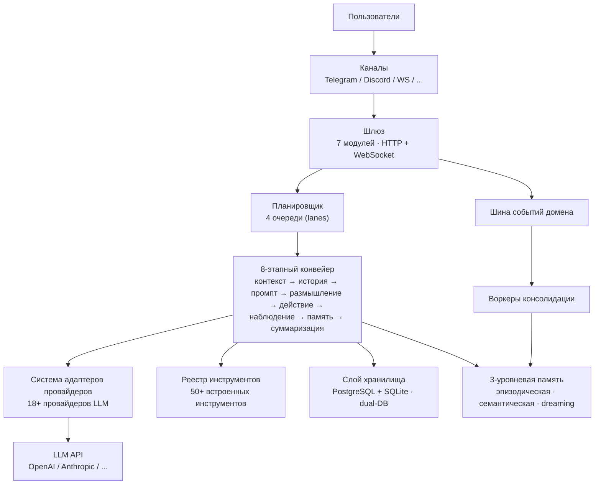

# Как работает GoClaw

> Архитектура шлюза для AI-агентов GoClaw.

## Обзор

GoClaw — это шлюз, который находится между вашими пользователями и провайдерами LLM. Он управляет полным жизненным циклом AI-диалогов: получает сообщения, направляет их агентам, вызывает LLM, выполняет инструменты и возвращает ответы через каналы связи.

## Схема архитектуры



## 8-этапный конвейер (Pipeline)

В версии v3 каждый запуск агента проходит через **модульный 8-этапный конвейер**. Устаревший режим с двумя путями удален — все агенты теперь всегда используют этот конвейер.

```
Настройка (выполняется один раз)
└─ ContextStage — внедрение контекста агента/пользователя/воркспейса

Цикл итераций (до 20 раз за один ход)
├─ ThinkStage   — сборка системного промпта, фильтрация инструментов, вызов LLM
├─ PruneStage   — мягкая/жесткая очистка контекста, сброс памяти при необходимости
├─ ToolStage    — выполнение вызовов инструментов (по возможности параллельно)
├─ ObserveStage — обработка результатов инструментов, добавление в буфер сообщений
└─ CheckpointStage — отслеживание итераций, проверка условий выхода

Завершение (выполняется один раз, сохраняется при отмене)
└─ FinalizeStage — очистка вывода, отправка сообщений, обновление метаданных сессии
```

### Детали этапов

| Этап | Фаза | Что делает |
|-------|-------|-------------|
| **ContextStage** | Настройка | Внедряет контекст агента/пользователя; разрешает файлы для каждого пользователя |
| **ThinkStage** | Итерация | Собирает системный промпт (15+ разделов), вызывает LLM, передает поток токенов |
| **PruneStage** | Итерация | Обрезает контекст при заполнении на ≥ 30% (мягко) или ≥ 50% (жестко); запускает сброс в память |
| **ToolStage** | Итерация | Выполняет вызовы инструментов — параллельные горутины для нескольких вызовов |
| **ObserveStage** | Итерация | Обрабатывает результаты инструментов; обрабатывает тихую остановку `NO_REPLY` |
| **CheckpointStage** | Итерация | Увеличивает счетчик; прерывает цикл при макс. итерациях или отмене контекста |
| **FinalizeStage** | Завершение | Выполняет 7-шаговую очистку вывода; атомарно отправляет сообщения; обновляет метаданные сессии |

## Поток сообщений

Вот что происходит, когда пользователь отправляет сообщение:

1. **Получение** — Сообщение поступает через канал (Telegram, WebSocket и т. д.).
2. **Валидация** — Проверка входных данных на наличие паттернов инъекций; ограничение длины сообщения (32 КБ).
3. **Маршрутизация** — Планировщик назначает сообщение агенту на основе привязок каналов.
4. **Очередь** — Очередь для каждой сессии управляет конкурентностью (1 на ЛС по умолчанию; до 3 для групп).
5. **Сборка контекста** — ContextStage внедряет личность, воркспейс и пользовательские файлы.
6. **Цикл конвейера** — 8-этапный конвейер выполняет до 20 итераций за один ход.
7. **Очистка** — FinalizeStage очищает вывод (удаляет теги размышления, битый XML, дубликаты).
8. **Доставка** — Ответ отправляется обратно через исходный канал.

## Очереди планировщика (Lanes)

GoClaw использует систему очередей (lanes) для управления конкурентностью:

| Очередь | Конкурентность | Назначение |
|------|:-----------:|---------|
| `main` | 30 | Сообщения каналов и запросы WebSocket |
| `subagent` | 50 | Задачи созданных субагентов |
| `team` | 100 | Делегирование между агентами в команде |
| `cron` | 30 | Запланированные задачи (cron) |

У каждой очереди есть свой семафор. Это предотвращает блокировку сообщений пользователей задачами cron и не дает делегированию перегрузить систему.

> Лимиты настраиваются через переменные окружения: `GOCLAW_LANE_MAIN`, `GOCLAW_LANE_SUBAGENT`, `GOCLAW_LANE_TEAM`, `GOCLAW_LANE_CRON`.

## Компоненты

| Компонент | Что делает |
|-----------|-------------|
| **Gateway** | Сервер HTTP + WebSocket; разделен на 7 модулей (зависимости, http, события, жизненный цикл и др.) |
| **Domain Event Bus** | Типизированная публикация событий с пулом воркеров, дедупликацией и повторами |
| **Provider Adapter System** | Управляет 18+ провайдерами LLM; Anthropic native, OpenAI-совместимые, ACP (JSON-RPC 2.0 stdio) |
| **Hooks Dispatcher** | Диспетчер хуков; 7 событий жизненного цикла (синхр/асинхр), защита от SSRF, аудит-логи |
| **Audio / TTS Manager** | Единый менеджер аудио: ElevenLabs, OpenAI, Edge, MiniMax; LRU-кеш голосов |
| **Tool Registry** | 50+ встроенных инструментов с контролем доступа на основе политик |
| **Store Layer** | Dual-DB: PostgreSQL для продакшна + SQLite для десктопа; общий интерфейс диалектов |
| **3-Tier Memory** | Эпизодическая → Семантическая → "Dreaming" память; управляется воркерами консолидации |
| **Orchestration Module** | `BatchQueue[T]` для агрегации результатов; захват ChildResult; помощники конвертации медиа |
| **Consolidation Workers** | Воркеры (эпизодический, семантический и др.) потребляют события из DomainEventBus |
| **Channel Managers** | Адаптеры для Telegram, Discord, WhatsApp (native), Zalo, Feishu |
| **Scheduler** | Конкурентность в 4 очередях с очередями на уровне сессий |

## Обзор систем v3

GoClaw v3 включает пять новых систем:

| Система | Что добавляет |
|--------|-------------|
| [Knowledge Vault](/knowledge-vault) | Семантическая сеть документов, гибридный поиск, авто-внедрение в промпты |
| [3-Tier Memory](../core-concepts/memory-system.md) | Конвейер консолидации памяти (Эпизодическая → Семантическая → Dreaming) |
| [Agent Evolution](/agent-evolution) | Отслеживает паттерны использования инструментов; предлагает и применяет адаптации |
| [Mode Prompt System](/model-steering) | Переключаемые режимы промптов (Полный vs Минимальный) |
| [Multi-Tenant v3](/multi-tenancy) | Глобальная изоляция пользователей во всех интерфейсах хранилища |

## Распространенные проблемы

| Проблема | Решение |
|---------|----------|
| Агент не отвечает | Проверьте лимиты очередей планировщика; проверьте API-ключ провайдера |
| Медленные ответы | Большой контекст + много инструментов = медленные вызовы LLM; уменьшите их количество |
| Ошибка вызова инструмента | Проверьте уровень `tools.exec_approval`; проверьте запрещенные паттерны для shell-команд |

## Что дальше?

- [Объяснение агентов](/agents-explained) — Глубокое погружение в типы агентов и файлы контекста
- [Обзор инструментов](/tools-overview) — Полный каталог инструментов
- [Сессии и история](../core-concepts/sessions-and-history.md) — Как сохраняются диалоги

<!-- goclaw-source: 050aafc9 | updated: 2026-04-17 -->
