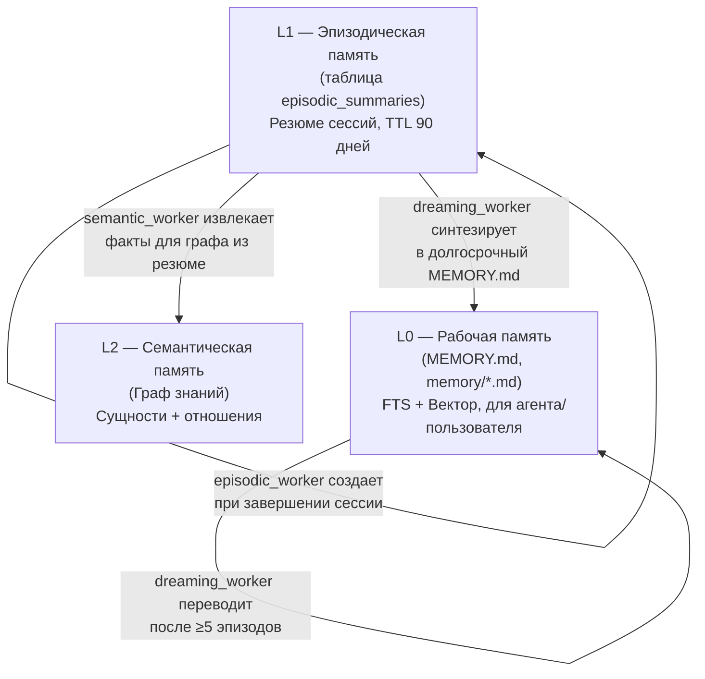
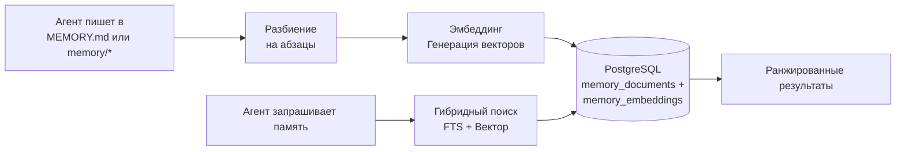

# Система памяти

> Как агенты запоминают факты между диалогами, используя 3-уровневую архитектуру с автоматической консолидацией.

## Обзор

В GoClaw v3 агенты обладают долгосрочной памятью, которая сохраняется между сессиями. Память организована в три уровня — рабочая, эпизодическая и семантическая. Каждая из них служит определенной цели в жизненном цикле воспоминаний. Фоновый процесс консолидации автоматически переводит воспоминания между уровнями без участия агента.

## 3-уровневая архитектура памяти

| Уровень | Хранилище | Контент | Срок жизни | Поиск |
|------|---------|---------|---------|--------|
| **L0 Рабочая** | `memory_documents` + `memory_embeddings` | Факты, заметки авто-сброса, результаты "dreaming" | Постоянно | Гибридный (FTS + вектор) |
| **L1 Эпизодическая** | `episodic_summaries` | Резюме сессий, ключевые темы | 90 дней (настраиваемо) | Гибридный |
| **L2 Семантическая** | Таблицы Графа знаний | Сущности, связи | Постоянно | Обход графа |

### Правила перевода между уровнями

- **Сессия → L1**: При завершении сессии `episodic_worker` создает резюме в таблице `episodic_summaries`. Используется резюме сжатия (если есть) или вызывается LLM.
- **L1 → L2**: После создания эпизодического резюме `semantic_worker` извлекает из него сущности и связи для Графа знаний.
- **L1 → L0**: Когда накапливается ≥5 эпизодов для пары агент/пользователь, `dreaming_worker` синтезирует их в долгосрочный Markdown-документ в папке `_system/dreaming/` и помечает эпизоды как обработанные.

## Как это работает

### Запись в память (L0)

Когда агент пишет в `MEMORY.md` или файлы в `memory/*`:
1. GoClaw **перехватывает** запись (данные идут в БД, а не в файловую систему).
2. **Разбивает** текст на фрагменты по абзацам (макс. 1000 символов).
3. **Создает эмбеддинги** для каждого фрагмента.
4. **Сохраняет** текст (с индексом для полнотекстового поиска) и вектор.

### Поиск по памяти

При вызове `memory_search` GoClaw выполняет гибридный поиск:
- **Полнотекстовый поиск (FTS)** (вес 0.3): хорошо находит точные термины.
- **Векторное сходство** (вес 0.7): хорошо находит смысл (семантику).

Результаты ранжируются с учетом весов и повышающего коэффициента (1.2x) для данных текущего пользователя.

### Поиск по Графу знаний

`knowledge_graph_search` дополняет текстовый поиск, позволяя находить связи между сущностями (например, "над какими проектами работает Алиса?").

## Воркеры консолидации

Все процессы консолидации работают в фоне:
- **`episodic_worker`**: Создает резюме сессий (L1).
- **`semantic_worker`**: Извлекает знания для графа (L2) из резюме L1.
- **`dedup_worker`**: Находит и объединяет дубликаты сущностей в графе.
- **`dreaming_worker`**: Объединяет несколько резюме L1 в долгосрочные записи L0.

## Авто-инъекция (Auto-Injector)

В начале каждого хода GoClaw автоматически ищет релевантные воспоминания и вставляет их в системный промпт (до 200 токенов). Это позволяет агенту "вспоминать" контекст без явного вызова поиска.

## Автоматический сброс памяти (Auto Memory Flush)

При автоматическом сжатии длинных диалогов GoClaw извлекает важные факты и сохраняет их в память (`memory/YYYY-MM-DD.md`) прежде чем удалить старые сообщения из истории.

## Общий доступ в командах

Участники команды могут **читать память лидера**:
- `memory_search` и `memory_get` сначала ищут в своей памяти, а затем в памяти лидера.
- **Запись заблокирована**: только лидер команды может изменять файлы памяти.

## Требования

Для работы памяти необходимы:
- **PostgreSQL 15+** с расширением `pgvector`.
- Настроенный **провайдер эмбеддингов**.
- Опция `memory: true` в настройках агента (включена по умолчанию).

## Что дальше?

- [Многопользовательский режим](/multi-tenancy) — Изоляция памяти пользователей.
- [Сессии и история](../core-concepts/sessions-and-history.md) — Работа истории диалогов.
- [Объяснение агентов](/agents-explained) — Типы агентов и файлы контекста.

<!-- goclaw-source: 050aafc9 | updated: 2026-04-09 -->
