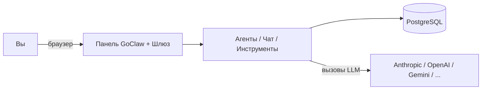
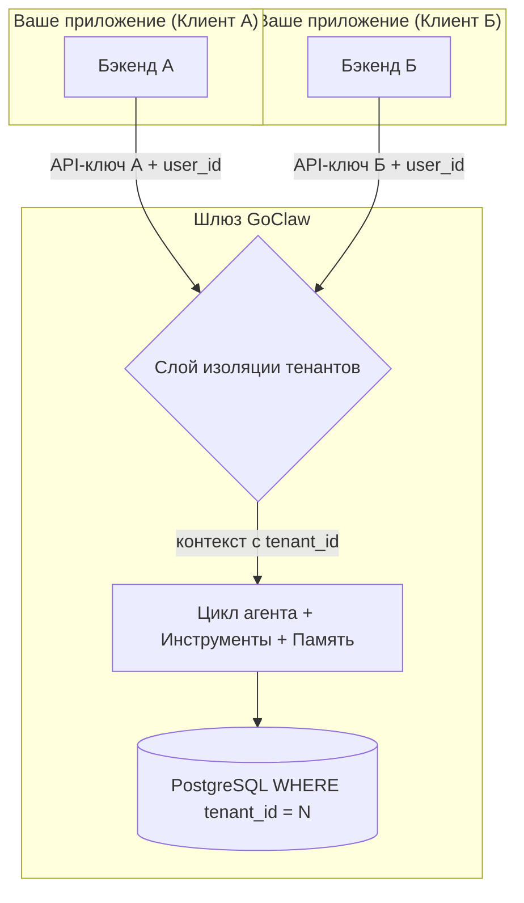
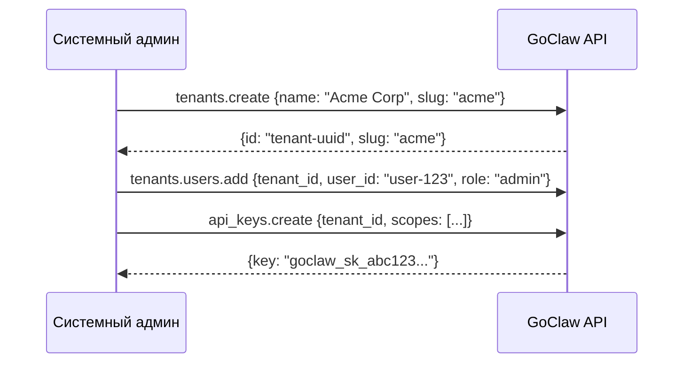

# Многопользовательский режим (Multi-Tenancy)

> Как GoClaw изолирует данные — от одного пользователя до полноценной SaaS-платформы.

## Обзор

GoClaw поддерживает два режима развертывания: **персональный** (один тенант, один пользователь или небольшая команда) и **SaaS** (многопользовательский, множество изолированных клиентов). Оба режима используют один и тот же бинарный файл — выбор режима зависит от настроек. В любом режиме все данные изолированы, так что пользователи никогда не увидят чужих агентов, сессий или памяти.

---

## Режимы развертывания

### Персональный режим (Single-Tenant)

Используйте GoClaw как автономный AI-бэкенд со встроенной панелью управления. Отдельный фронтенд не требуется.

**Как это работает:**
- Авторизуйтесь с токеном шлюза во встроенной панели управления.
- Создавайте агентов, настраивайте провайдеров LLM, общайтесь — все из панели управления.
- Подключайте каналы чатов (Telegram, Discord и др.).
- Все данные хранятся в основном тенанте по умолчанию.

**Настройка:**
1. Соберите проект: `go build -o goclaw . && ./goclaw onboard`.
2. Запустите шлюз: `source .env.local && ./goclaw`.
3. Откройте панель: `http://localhost:3777` (вход с токеном шлюза и ID пользователя `system`).

**Изоляция пользователей:** GoClaw сам не аутентифицирует пользователей. Ваше приложение передает ID пользователя в заголовке `X-GoClaw-User-Id` — GoClaw изолирует все данные под этот ID.

---

### SaaS-режим (Multi-Tenant)

Интегрируйте GoClaw как AI-движок в ваше SaaS-приложение. Ваше приложение берет на себя авторизацию и биллинг, а GoClaw — работу с AI. Каждый клиент (тенант) полностью изолирован.

**Как это работает:**
- Бэкенд каждого клиента подключается с использованием **API-ключа, привязанного к тенанту**.
- Слой изоляции определяет `tenant_id` по ключу и внедряет его в контекст.
- Каждый SQL-запрос принудительно использует условие `WHERE tenant_id = $N`, что исключает утечку данных между клиентами.

---

## Настройка тенанта

Настройка нового клиента включает три шага: создание тенанта, добавление пользователей и создание API-ключа.

---

## Заголовки HTTP API

Все эндпоинты принимают стандартные заголовки:

| Заголовок | Обязателен | Описание |
|--------|:---:|-------------|
| `Authorization` | Да | `Bearer <api-key-or-gateway-token>` |
| `X-GoClaw-User-Id` | Да | ID пользователя вашей системы (макс. 255 симв.) |
| `X-GoClaw-Tenant-Id` | Нет | UUID или слаг тенанта. Нужно только для системных ключей |
| `Accept-Language` | Нет | Язык сообщений об ошибках: `en`, `vi`, `zh` |

---

## Области доступа API-ключей (Scopes)

| Scope | Роль | Разрешения |
|-------|------|-------------|
| `operator.admin` | admin | Полный доступ — агенты, конфиг, ключи, тенанты |
| `operator.read` | viewer | Только чтение — список агентов, сессии, конфиги |
| `operator.write` | operator | Чтение + запись — чат, создание сессий, управление агентами |
| `operator.approvals` | operator | Подтверждение/отклонение запросов на выполнение |

---

## Модель безопасности

- **SQL-изоляция**: Все запросы включают `WHERE tenant_id = $N` на уровне кода.
- **Хранение ключей**: Ключи хранятся в виде хешей SHA-256.
- **revocation**: Отзыв доступа к тенанту немедленно разрывает WebSocket-соединения и заставляет выйти из UI.
- **HMAC-подпись**: Ссылки на файлы защищены HMAC-токенами, токен шлюза в ссылках не светится.

---

## Модели редакций (Editions)

GoClaw поставляется в двух редакциях, ограничивающих ресурсы на уровне всей установки:

| Функция | Standard | Lite |
|---------|:--------:|:----:|
| Макс. агентов | без ограничений | 5 |
| Макс. команд | без ограничений | 1 |
| Параллельных субагентов | без ограничений | 2 |
| Глубина вложенности субагентов | без ограничений | 1 |
| Граф знаний | ✓ | ✗ |

---

## Что дальше?

- [Как работает GoClaw](how-goclaw-works.md) — Обзор архитектуры.
- [Сессии и история](sessions-and-history.md) — Управление сессиями пользователей.
- [Объяснение агентов](agents-explained.md) — Типы агентов и контроль доступа.

<!-- goclaw-source: 1296cdbf | updated: 2026-04-11 -->
