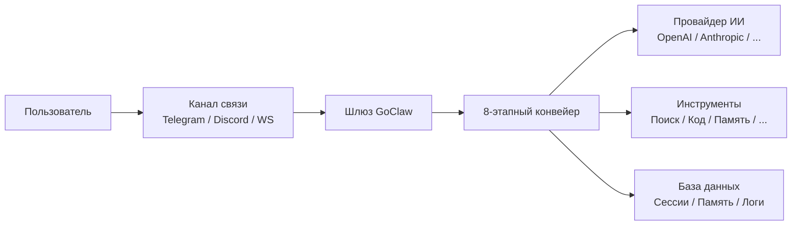

# Что такое GoClaw

> Многопользовательский шлюз для ИИ-агентов, объединяющий нейросети, мессенджеры, инструменты и команды.

## Обзор
GoClaw — это шлюз для ИИ-агентов с открытым исходным кодом, написанный на языке Go. Он позволяет запускать умных ботов, которые могут общаться в Telegram, Discord, WhatsApp и других каналах, используя общие инструменты, память и контекст. Представьте это как мост между вашими провайдерами нейросетей (OpenAI, Anthropic и др.) и реальным миром.

## Ключевые возможности

| Категория | Что вы получаете |
|-----------|------------------|
| **Мультиарендность (v3)** | Полная изоляция данных пользователей: контекста, сессий, памяти и логов. |
| **8-этапный конвейер** | Умный цикл работы агента: контекст → история → промпт → размышление → действие → наблюдение → память → резюме. |
| **24 типа провайдеров** | Поддержка OpenAI, Anthropic, Google, Groq, DeepSeek, локальных моделей и даже консольных агентов (Claude Code). |
| **Каналы связи** | Telegram, Discord, WhatsApp (нативный), Slack, WebSocket и др. |
| **32 встроенных инструмента** | Работа с файлами, поиск в интернете, выполнение кода, управление памятью и многое другое. |
| **Умная память** | Трехуровневая система памяти (краткосрочная, семантическая, долгосрочная) с автоматической консолидацией фактов. |
| **База знаний (Vault)** | Создание внутренней базы знаний с автоматическим резюмированием и семантическими связями между документами. |
| **Граф знаний** | Извлечение сущностей и связей из текстов для построения структурированной карты знаний. |
| **Безопасность** | Лимиты запросов, защита от SSRF, скрытие секретных ключей в логах, ролевая модель доступа. |
| **Один бинарный файл** | Весь шлюз — это один файл размером ~25 МБ, который запускается менее чем за секунду. |

## Для кого этот проект?
- **Разработчикам**, создающим умных чат-ботов и ассистентов.
- **Командам**, которым нужны общие ИИ-агенты с разграничением прав доступа.
- **Компаниям**, которым требуется безопасная и изолированная среда для работы с LLM.

## Как это работает

1. Пользователь пишет сообщение в **канал** (например, Telegram).
2. **Шлюз** направляет его нужному агенту.
3. Запускается **конвейер**: агент собирает историю, готовит запрос, "думает", выполняет нужные **действия** (например, ищет в Google), сохраняет новые факты в **память** и готовит ответ.
4. Ответ отправляется пользователю обратно в мессенджер.

## Что дальше
- [Установка](/installation) — Запуск GoClaw на вашем сервере или ПК.
- [Быстрый старт](/quick-start) — Создание вашего первого агента за 5 минут.

<!-- goclaw-source: 050aafc9 | updated: 2026-04-17 -->
