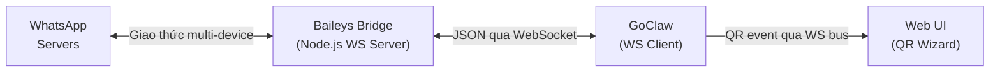

> Bản dịch từ [English version](/channel-whatsapp)

# Channel WhatsApp

Tích hợp WhatsApp qua bridge WebSocket dựa trên Baileys. GoClaw kết nối như WS client đến bridge, bridge xử lý giao thức multi-device của WhatsApp (không cần Chrome).

## Thiết lập

### Bắt đầu nhanh (Docker Compose)

Cách nhanh nhất để chạy WhatsApp là dùng Docker Compose overlay đi kèm:

```bash
docker compose -f docker-compose.yml -f docker-compose.postgres.yml -f docker-compose.whatsapp.yml up -d
```

Sau đó trong giao diện GoClaw:
1. **Channels > Add Channel > WhatsApp**
2. Đặt **Bridge URL** thành `ws://whatsapp-bridge:3001`
3. Chọn agent, bấm **Create & Scan QR**
4. Quét QR bằng WhatsApp (Bạn > Thiết bị liên kết > Liên kết thiết bị)

### Chạy Bridge thủ công

Nếu bạn muốn chạy bridge ngoài Docker:

```bash
cd bridge/whatsapp
npm install
node server.js
```

Biến môi trường:

| Biến | Mặc định | Mô tả |
|------|---------|-------|
| `BRIDGE_PORT` | `3001` | Cổng WebSocket server |
| `AUTH_DIR` | `./auth_info` | Thư mục lưu trạng thái xác thực WhatsApp |
| `MEDIA_DIR` | Thư mục temp hệ thống | Thư mục lưu media tải về |
| `MEDIA_MAX_BYTES` | `20971520` (20 MB) | Kích thước media tối đa |
| `LOG_LEVEL` | `silent` | Mức log bridge (`silent`, `warn`) |
| `PRINT_QR` | `false` | In QR code ra terminal (hữu ích khi không có UI) |

### Cấu hình qua file config

Cho channel cấu hình qua file (thay vì DB instance):

```json
{
  "channels": {
    "whatsapp": {
      "enabled": true,
      "bridge_url": "ws://localhost:3001",
      "dm_policy": "pairing",
      "group_policy": "pairing"
    }
  }
}
```

## Cấu hình

Tất cả config key nằm trong `channels.whatsapp` (file config) hoặc config JSON của instance (DB):

| Key | Kiểu | Mặc định | Mô tả |
|-----|------|---------|-------|
| `enabled` | bool | `false` | Bật/tắt channel |
| `bridge_url` | string | bắt buộc | URL WebSocket đến bridge (ví dụ: `ws://bridge:3001`) |
| `allow_from` | list | -- | Danh sách trắng user/group ID |
| `dm_policy` | string | `"pairing"` | `pairing`, `open`, `allowlist`, `disabled` |
| `group_policy` | string | `"pairing"` (DB) / `"open"` (config) | `pairing`, `open`, `allowlist`, `disabled` |
| `require_mention` | bool | `false` | Chỉ trả lời trong nhóm khi bot được @mention |
| `block_reply` | bool | -- | Ghi đè block_reply của gateway (nil=kế thừa) |

## Kiến trúc



- **Bridge** là WebSocket **server** (mặc định cổng 3001)
- **GoClaw** kết nối như **client** và xử lý routing, AI, pairing
- Một bridge instance = một số điện thoại WhatsApp
- File media được trao đổi qua shared volume (`/tmp/goclaw_wa_media`)

## Tính năng

### Xác thực QR Code

WhatsApp yêu cầu quét QR để liên kết thiết bị. Quy trình:

1. Bridge tạo QR qua kết nối Baileys
2. Bridge gửi `{type: "qr", data: "<qr-string>"}` đến GoClaw
3. GoClaw mã hóa thành PNG và broadcast qua bus event
4. Web UI wizard hiển thị ảnh QR
5. Người dùng quét bằng WhatsApp (Bạn > Thiết bị liên kết > Liên kết thiết bị)
6. Bridge xác nhận xác thực: `{type: "status", connected: true}`

**Xác thực lại**: Dùng nút "Re-authenticate" trong bảng channels để buộc quét QR mới (đăng xuất phiên WhatsApp hiện tại).

### Chính sách DM và Nhóm

Nhóm WhatsApp có chat ID kết thúc bằng `@g.us`:

- **DM**: `"1234567890@s.whatsapp.net"`
- **Nhóm**: `"120363012345@g.us"`

Các chính sách có sẵn:

| Chính sách | Hành vi |
|-----------|---------|
| `open` | Chấp nhận tất cả tin nhắn |
| `pairing` | Yêu cầu phê duyệt mã pairing (mặc định cho DB instance) |
| `allowlist` | Chỉ user trong `allow_from` |
| `disabled` | Từ chối tất cả tin nhắn |

Chính sách `pairing` cho nhóm: nhóm chưa ghép nối nhận mã pairing. Phê duyệt qua `goclaw pairing approve <CODE>`.

### @Mention Gating

Khi `require_mention` là `true`, bot chỉ trả lời trong nhóm khi được @mention trực tiếp. Fail-closed — nếu JID của bot chưa xác định, tin nhắn sẽ bị bỏ qua.

### Hỗ trợ Media

Bridge tải media đến (ảnh, video, audio, tài liệu, sticker) vào shared volume. GoClaw đọc các file này và chuyển vào pipeline agent.

Loại media đến được hỗ trợ: image, video, audio, document, sticker.

Media đi: GoClaw ghi file vào shared volume và gửi đường dẫn đến bridge để gửi đi.

**Shared volume** (Docker): Cả container `goclaw` và `whatsapp-bridge` mount cùng volume tại `/tmp/goclaw_wa_media`.

### Định dạng tin nhắn

Output LLM được chuyển đổi từ Markdown sang định dạng native của WhatsApp:

| Markdown | WhatsApp | Hiển thị |
|----------|----------|---------|
| `**bold**` | `*bold*` | **bold** |
| `_italic_` | `_italic_` | _italic_ |
| `~~strikethrough~~` | `~strikethrough~` | ~~strikethrough~~ |
| `` `inline code` `` | ` ```code``` ` | `code` |
| `# Header` | `*Header*` | **Header** |
| `[text](url)` | `text url` | text url |
| `- list item` | `* list item` | * list item |

Fenced code block được giữ nguyên dạng ` ``` `. Tag HTML từ output LLM được tiền xử lý thành Markdown trước khi chuyển đổi.

### Chỉ báo đang nhập

GoClaw hiển thị "đang nhập..." trong WhatsApp khi agent xử lý tin nhắn. WhatsApp xóa chỉ báo sau ~10 giây, nên GoClaw làm mới mỗi 8 giây cho đến khi gửi trả lời.

### Tự động kết nối lại

Nếu kết nối bridge bị đứt:
- Exponential backoff: 1s > 2s > 4s > ... > tối đa 30s
- Thử lại liên tục cho đến khi bridge khả dụng
- Trạng thái sức khỏe channel được cập nhật (degraded/healthy)

## Giao thức Bridge

### Bridge > GoClaw

| Loại | Payload | Mô tả |
|------|---------|-------|
| `status` | `{connected: bool, me: "jid"}` | Trạng thái xác thực (gửi khi kết nối + thay đổi) |
| `qr` | `{data: "qr-string"}` | QR code để quét |
| `message` | `{id, from, chat, content, from_name, is_group, mentioned_jids, media}` | Tin nhắn đến |
| `pong` | `{}` | Phản hồi ping |

### GoClaw > Bridge

| Loại | Payload | Mô tả |
|------|---------|-------|
| `message` | `{to: "jid", content: "text"}` | Gửi tin nhắn |
| `command` | `{action: "reauth"}` | Đăng xuất + khởi động lại QR |
| `command` | `{action: "ping"}` | Kiểm tra sức khỏe |
| `command` | `{action: "presence", to, state}` | Presence (composing/paused) |

## Docker Compose

File `docker-compose.whatsapp.yml` overlay thêm dịch vụ bridge:

```yaml
services:
  whatsapp-bridge:
    build: ./bridge/whatsapp
    ports:
      - "3001:3001"
    volumes:
      - wa_auth:/app/auth_info        # Trạng thái xác thực bền vững
      - wa_media:/tmp/goclaw_wa_media  # Shared media volume
    environment:
      - BRIDGE_PORT=3001
      - PRINT_QR=false

  goclaw:
    volumes:
      - wa_media:/tmp/goclaw_wa_media  # Cùng media volume

volumes:
  wa_auth:
  wa_media:
```

## Xử lý sự cố

| Vấn đề | Giải pháp |
|--------|----------|
| "Connection refused" | Xác minh bridge đang chạy và `bridge_url` đúng. Với Docker, dùng `ws://whatsapp-bridge:3001`. |
| Không hiển thị QR | Kiểm tra log bridge. Đảm bảo bridge kết nối được WhatsApp server. Thử `PRINT_QR=true` để hiện QR trong terminal. |
| Quét QR nhưng không xác thực | Trạng thái xác thực có thể bị hỏng. Xóa thư mục `auth_info/` và khởi động lại bridge. |
| Không nhận tin nhắn | Kiểm tra giao thức bridge: phải gửi `type:"message"` với field `from`/`content` (không phải `sender`/`body`). |
| Không nhận media | Đảm bảo shared volume được mount trong cả hai container. Kiểm tra giới hạn `MEDIA_MAX_BYTES`. |
| Cảnh báo "Bridge format mismatch" | Bridge gửi tin nhắn thiếu field `type`. Thêm `type:"message"` và dùng tên field `from`/`content`. |
| Chỉ báo đang nhập bị kẹt | GoClaw tự hủy typing khi gửi trả lời. Nếu bị kẹt, kết nối bridge có thể đã đứt. |
| Tin nhắn nhóm bị bỏ qua | Kiểm tra `group_policy`. Nếu là `pairing`, nhóm cần phê duyệt. Nếu `require_mention` là true, @mention bot. |

## Tiếp theo

- [Tổng quan](/channels-overview) — Khái niệm và chính sách channel
- [Telegram](/channel-telegram) — Thiết lập Telegram bot
- [Larksuite](/channel-feishu) — Tích hợp Larksuite
- [Browser Pairing](/channel-browser-pairing) — Luồng pairing

<!-- goclaw-source: e7626ed5 | cập nhật: 2026-04-06 -->
