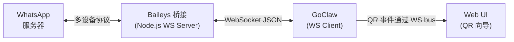

> 翻译自 [English version](/channel-whatsapp)

# WhatsApp Channel

通过基于 Baileys 的外部 WebSocket 桥接集成 WhatsApp。GoClaw 作为 WS 客户端连接到桥接，桥接处理 WhatsApp 多设备协议（无需 Chrome）。

## 设置

### 快速开始（Docker Compose）

最快的方式是使用自带的 Docker Compose overlay：

```bash
docker compose -f docker-compose.yml -f docker-compose.postgres.yml -f docker-compose.whatsapp.yml up -d
```

然后在 GoClaw 界面中：
1. **Channels > Add Channel > WhatsApp**
2. 将 **Bridge URL** 设为 `ws://whatsapp-bridge:3001`
3. 选择 agent，点击 **Create & Scan QR**
4. 用 WhatsApp 扫描 QR 码（你 > 已关联的设备 > 关联设备）

### 手动运行桥接

如果您想在 Docker 外运行桥接：

```bash
cd bridge/whatsapp
npm install
node server.js
```

环境变量：

| 变量 | 默认值 | 说明 |
|------|--------|------|
| `BRIDGE_PORT` | `3001` | WebSocket 服务端口 |
| `AUTH_DIR` | `./auth_info` | WhatsApp 认证状态存储目录 |
| `MEDIA_DIR` | 系统临时目录 | 下载媒体文件存储目录 |
| `MEDIA_MAX_BYTES` | `20971520`（20 MB） | 最大媒体下载大小 |
| `LOG_LEVEL` | `silent` | 桥接日志级别（`silent`、`warn`） |
| `PRINT_QR` | `false` | 在终端打印 QR 码（无 UI 时有用） |

### 配置文件设置

通过配置文件（而非 DB 实例）设置 channel：

```json
{
  "channels": {
    "whatsapp": {
      "enabled": true,
      "bridge_url": "ws://localhost:3001",
      "dm_policy": "pairing",
      "group_policy": "pairing"
    }
  }
}
```

## 配置

所有配置项位于 `channels.whatsapp`（配置文件）或实例配置 JSON（DB）：

| 配置项 | 类型 | 默认值 | 说明 |
|--------|------|--------|------|
| `enabled` | bool | `false` | 启用/禁用 channel |
| `bridge_url` | string | 必填 | 到桥接的 WebSocket URL（如 `ws://bridge:3001`） |
| `allow_from` | list | -- | 用户/群组 ID 白名单 |
| `dm_policy` | string | `"pairing"` | `pairing`、`open`、`allowlist`、`disabled` |
| `group_policy` | string | `"pairing"`（DB）/ `"open"`（配置） | `pairing`、`open`、`allowlist`、`disabled` |
| `require_mention` | bool | `false` | 仅在群组中被 @提及时回复 |
| `block_reply` | bool | -- | 覆盖 gateway block_reply（nil=继承） |

## 架构



- **桥接**是 WebSocket **服务器**（默认端口 3001）
- **GoClaw** 作为**客户端**连接，处理路由、AI、配对
- 一个桥接实例 = 一个 WhatsApp 手机号
- 媒体文件通过共享卷交换（`/tmp/goclaw_wa_media`）

## 功能特性

### QR 码认证

WhatsApp 需要扫描 QR 码来关联设备。流程：

1. 桥接通过 Baileys 连接生成 QR
2. 桥接发送 `{type: "qr", data: "<qr-string>"}` 给 GoClaw
3. GoClaw 编码为 PNG 并通过 bus 事件广播
4. Web UI 向导显示 QR 图片
5. 用户用 WhatsApp 扫描（你 > 已关联的设备 > 关联设备）
6. 桥接确认认证：`{type: "status", connected: true}`

**重新认证**：在 channels 表中点击"Re-authenticate"按钮强制新 QR 扫描（登出当前 WhatsApp 会话）。

### DM 和群组策略

WhatsApp 群组的 chat ID 以 `@g.us` 结尾：

- **DM**：`"1234567890@s.whatsapp.net"`
- **群组**：`"120363012345@g.us"`

可用策略：

| 策略 | 行为 |
|------|------|
| `open` | 接受所有消息 |
| `pairing` | 需要配对码审批（DB 实例默认） |
| `allowlist` | 仅 `allow_from` 中的用户 |
| `disabled` | 拒绝所有消息 |

群组 `pairing` 策略：未配对的群组会收到配对码回复。通过 `goclaw pairing approve <CODE>` 审批。

### @提及过滤

当 `require_mention` 为 `true` 时，机器人仅在群聊中被明确 @提及时才回复。失败关闭 —— 如果机器人的 JID 未知，消息将被忽略。

### 媒体支持

桥接将收到的媒体（图片、视频、音频、文档、贴纸）下载到共享卷。GoClaw 读取这些文件并传入 agent 管道。

支持的入站媒体类型：image、video、audio、document、sticker。

出站媒体：GoClaw 将文件写入共享卷，发送路径给桥接进行投递。

**共享卷**（Docker）：`goclaw` 和 `whatsapp-bridge` 容器都挂载同一卷到 `/tmp/goclaw_wa_media`。

### 消息格式化

LLM 输出从 Markdown 转换为 WhatsApp 原生格式：

| Markdown | WhatsApp | 显示效果 |
|----------|----------|----------|
| `**bold**` | `*bold*` | **bold** |
| `_italic_` | `_italic_` | _italic_ |
| `~~strikethrough~~` | `~strikethrough~` | ~~strikethrough~~ |
| `` `inline code` `` | ` ```code``` ` | `code` |
| `# Header` | `*Header*` | **Header** |
| `[text](url)` | `text url` | text url |
| `- list item` | `* list item` | * list item |

围栏代码块保持为 ` ``` `。来自 LLM 输出的 HTML 标签在转换前预处理为 Markdown 等效形式。

### 输入指示器

GoClaw 在 agent 处理消息时在 WhatsApp 中显示"正在输入..."。WhatsApp 在约 10 秒后清除指示器，因此 GoClaw 每 8 秒刷新一次直到回复发送。

### 自动重连

若桥接连接断开：
- 指数退避：1s > 2s > 4s > ... > 最大 30s
- 持续重试直到桥接可用
- Channel 健康状态更新（degraded/healthy）

## 桥接协议

### 桥接 > GoClaw

| 类型 | 负载 | 说明 |
|------|------|------|
| `status` | `{connected: bool, me: "jid"}` | 认证状态（连接时和变更时发送） |
| `qr` | `{data: "qr-string"}` | 用于扫描的 QR 码 |
| `message` | `{id, from, chat, content, from_name, is_group, mentioned_jids, media}` | 收到的消息 |
| `pong` | `{}` | ping 的响应 |

### GoClaw > 桥接

| 类型 | 负载 | 说明 |
|------|------|------|
| `message` | `{to: "jid", content: "text"}` | 发送消息 |
| `command` | `{action: "reauth"}` | 登出 + 重启 QR 流程 |
| `command` | `{action: "ping"}` | 健康检查 |
| `command` | `{action: "presence", to, state}` | 在线状态（composing/paused） |

## Docker Compose

`docker-compose.whatsapp.yml` overlay 添加桥接服务：

```yaml
services:
  whatsapp-bridge:
    build: ./bridge/whatsapp
    ports:
      - "3001:3001"
    volumes:
      - wa_auth:/app/auth_info        # 持久化认证状态
      - wa_media:/tmp/goclaw_wa_media  # 共享媒体卷
    environment:
      - BRIDGE_PORT=3001
      - PRINT_QR=false

  goclaw:
    volumes:
      - wa_media:/tmp/goclaw_wa_media  # 同一媒体卷

volumes:
  wa_auth:
  wa_media:
```

## 故障排查

| 问题 | 解决方案 |
|------|----------|
| "Connection refused" | 验证桥接正在运行且 `bridge_url` 正确。Docker 环境使用 `ws://whatsapp-bridge:3001`。 |
| 不显示 QR 码 | 检查桥接日志。确保桥接能连接 WhatsApp 服务器。尝试 `PRINT_QR=true` 在终端显示 QR。 |
| 扫描 QR 但未认证 | 认证状态可能损坏。删除 `auth_info/` 目录并重启桥接。 |
| 未收到消息 | 检查桥接协议：必须发送 `type:"message"` 且包含 `from`/`content` 字段（不是 `sender`/`body`）。 |
| 未收到媒体 | 确保两个容器都挂载了共享卷。检查 `MEDIA_MAX_BYTES` 限制。 |
| "Bridge format mismatch" 警告 | 桥接发送的消息缺少 `type` 字段。添加 `type:"message"` 并使用 `from`/`content` 字段名。 |
| 输入指示器卡住 | GoClaw 在发送回复时自动取消 typing。如果卡住，桥接连接可能已断开。 |
| 群组消息被忽略 | 检查 `group_policy`。如果是 `pairing`，群组需要审批。如果 `require_mention` 为 true，@提及机器人。 |

## 下一步

- [概览](/channels-overview) — Channel 概念和策略
- [Telegram](/channel-telegram) — Telegram bot 设置
- [Larksuite](/channel-feishu) — Larksuite 集成
- [Browser Pairing](/channel-browser-pairing) — 配对流程

<!-- goclaw-source: e7626ed5 | 更新: 2026-04-06 -->
